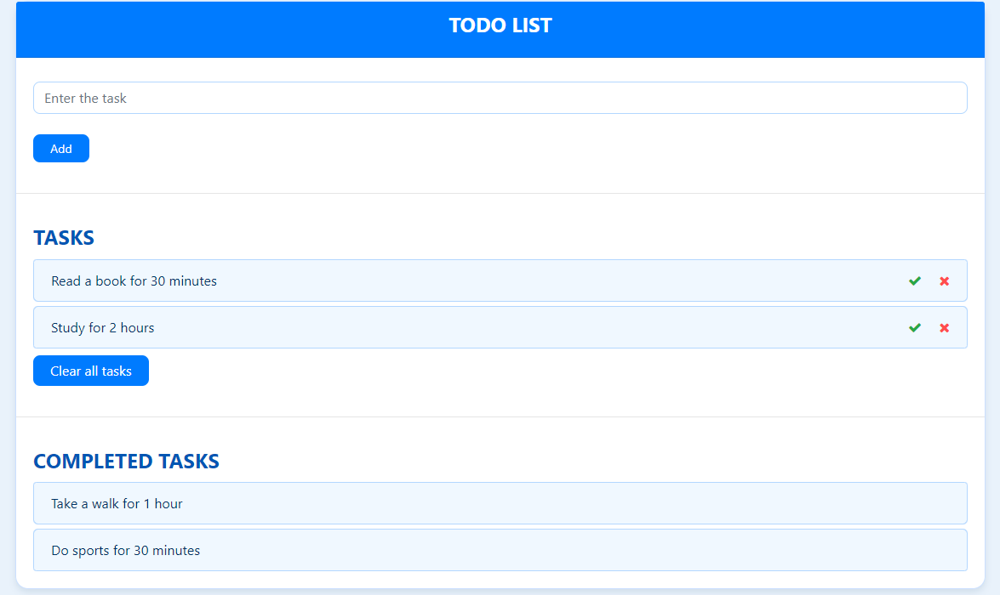

# ✅ Todo List Web Application

In this project, I developed a simple web application where users can add and track their daily tasks. The application is built using HTML, CSS, and JavaScript.

---

## 🚀 Features

- 📝 Add tasks  
- ✅ Mark tasks as completed  
- ❌ Delete tasks  
- 🧹 Clear all tasks  

---

## 🛠️ Technologies Used

- HTML5  
- CSS3  
- JavaScript (Vanilla JS)

---

## 💡 Usage

The user enters a task in the input field and clicks the "Add" button to add it to the task list.

- Clicking the **check** (✔️) icon marks the task as completed and moves it to the "Completed Tasks" section.
- If the task is no longer needed, clicking the **cross** (❌) icon deletes it from the list.
- Clicking the "Clear All Tasks" button removes all tasks from the list.

---

## 📸 Screenshot

---
